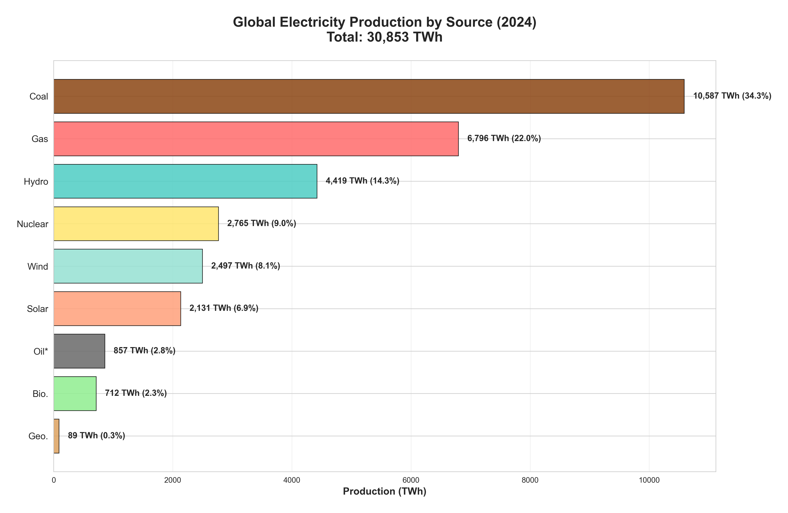
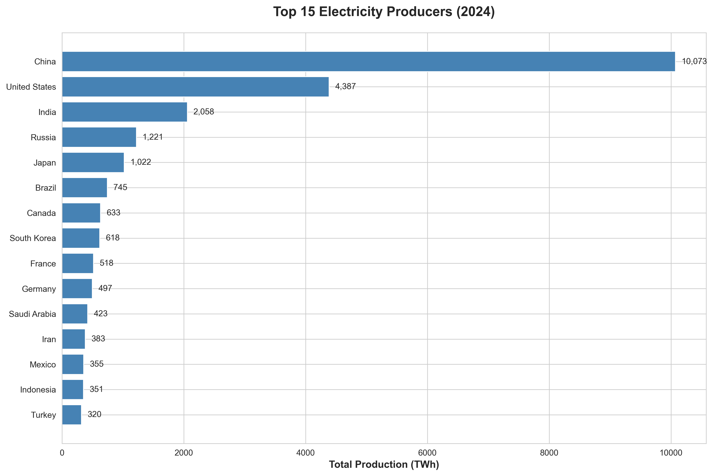
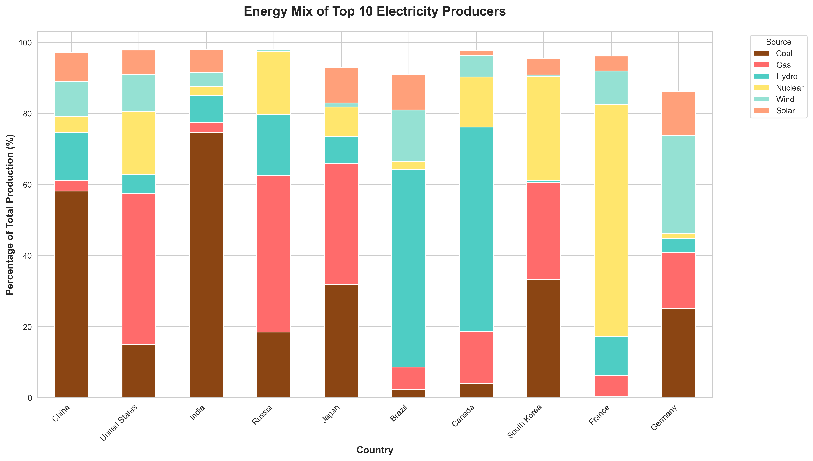
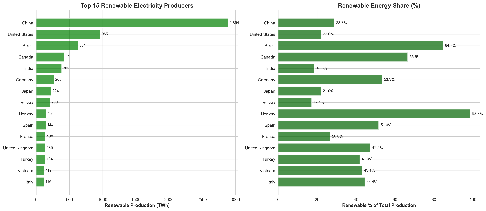
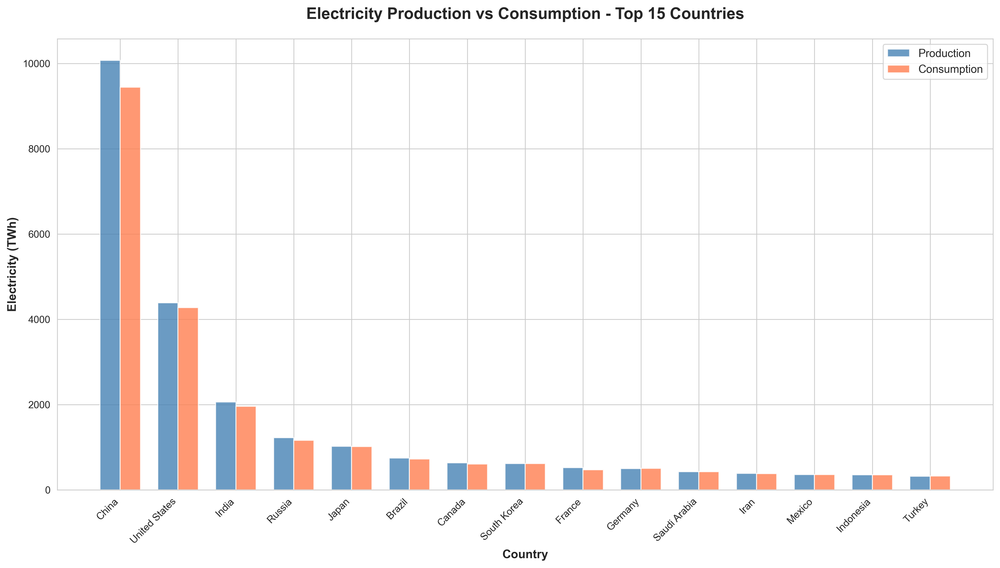
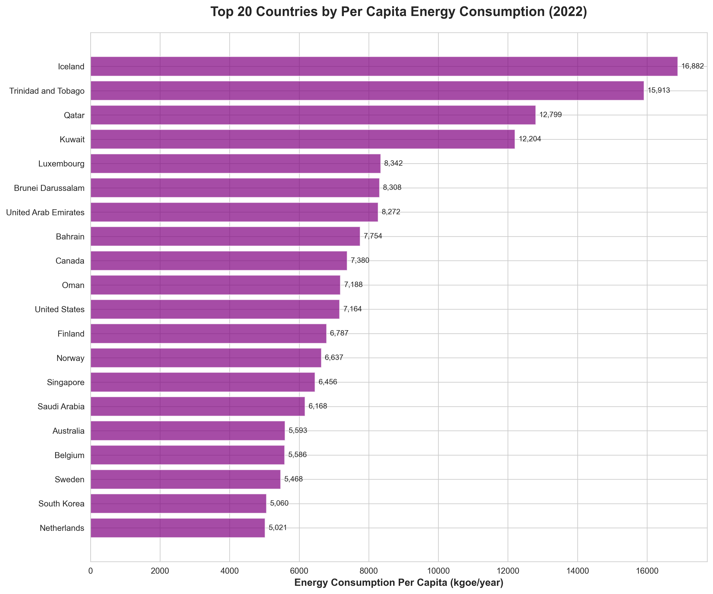
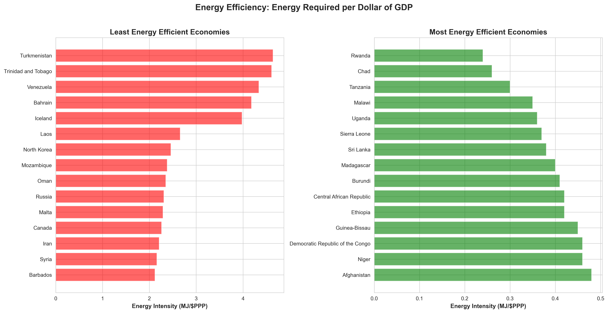
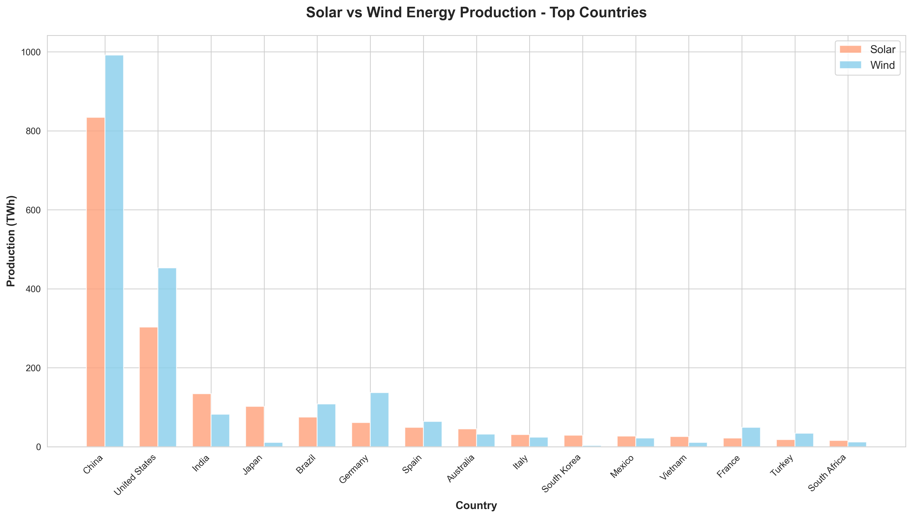

# Global Electricity Production & Consumption Analysis

**Comprehensive analysis of global electricity production, consumption, and energy efficiency patterns**

---

## Table of Contents
1. [Executive Summary](#executive-summary)
2. [Global Energy Mix](#1-global-energy-mix)
3. [Top Electricity Producers](#2-top-electricity-producers)
4. [Energy Mix by Country](#3-energy-mix-by-country)
5. [Renewable Energy Analysis](#4-renewable-energy-analysis)
6. [Production vs Consumption](#5-production-vs-consumption)
7. [Per Capita Consumption](#6-per-capita-consumption)
8. [Energy Efficiency](#7-energy-efficiency)
9. [Solar vs Wind](#8-solar-vs-wind)
10. [Key Takeaways](#key-takeaways)

---

## Executive Summary

This analysis examines global electricity production and consumption patterns across 213 countries. The study reveals:

- **Total Global Production**: 30,853 TWh (2024)
- **Total Global Consumption**: 29,665 TWh (2023)
- **Renewable Share**: 29.1% of global production
- **Top 3 Producers**: China (32.6%), USA (14.2%), India (6.7%)

---

## 1. Global Energy Mix

### Finding
Coal (34.3%) and Gas (22.0%) account for over half of global electricity production. Renewables (Wind, Solar, Hydro) combined represent 29.1% of total production.

### Implications
- Fossil fuels still dominate global energy production
- Significant transition to renewable energy still needed to meet climate goals
- Wind + Solar alone represent 15.0% of global production, showing rapid growth
- Nuclear provides 9.0% of global electricity, serving as stable baseload power

---

## 2. Top Electricity Producers

### Finding
China produces 10,073 TWh, nearly 2.3x more than the USA (4,387 TWh). The top 3 producers (China, USA, India) account for 53.5% of global production.

### Insights
- **China's dominance**: Produces more than the next 3 countries combined
- **Regional concentration**: Top 10 producers account for 73% of global electricity
- **Emerging economies**: India (3rd) and Brazil (7th) are major producers
- **Geographic diversity**: Top 15 includes Asia (6), Americas (4), Europe (3), Middle East (2)

### Production Rankings
1. China: 10,073 TWh
2. USA: 4,387 TWh
3. India: 2,058 TWh
4. Russia: 1,221 TWh
5. Japan: 1,022 TWh

---

## 3. Energy Mix by Country

### Finding
China relies heavily on coal, USA has a balanced mix of gas/coal/nuclear/renewables, Brazil is dominated by hydro, and France leads in nuclear energy. Each country's energy mix reflects its natural resources and policy choices.

### Country Profiles

| Country | Coal | Gas | Nuclear | Hydro | Wind+Solar | Strategy |
|---------|------|-----|---------|-------|------------|----------|
| **China** | 58% | 3% | 4% | 13% | 17% | Coal-dominated transitioning to renewables |
| **USA** | 15% | 43% | 18% | 5% | 17% | Balanced fossil + nuclear + renewables |
| **Brazil** | 2% | 6% | 2% | 56% | 25% | Hydro-dominant renewable leader |
| **France** | 0.4% | 6% | 65% | 11% | 14% | Nuclear powerhouse |
| **Germany** | 25% | 16% | 1% | 4% | 40% | Renewable energy transition leader |

### Key Observations
- **France**: Highest nuclear dependency (65%) - stable, low-carbon baseload
- **Brazil/Canada**: Hydropower dominance reflects abundant water resources
- **Germany**: Leading renewable transition (40% wind+solar)
- **China/India**: Still coal-dependent but rapidly adding renewables
- **USA**: Most balanced mix - no single source >43%

---

## 4. Renewable Energy Analysis

### Finding
China leads in absolute renewable production (2,894 TWh), but countries like Brazil, Canada, and Norway have much higher renewable percentages (84.7%, 66.5%, 98.7% respectively), showing different paths to clean energy.

### Two Paths to Clean Energy

**Path 1: Absolute Volume Leaders**
- China: 2,894 TWh (29% of total)
- USA: 965 TWh (22% of total)
- Brazil: 631 TWh (85% of total)

**Path 2: High Percentage Leaders**
- Norway: 99% renewable (mainly hydro)
- Brazil: 85% renewable (mainly hydro)
- Canada: 67% renewable (mainly hydro)
- Sweden: 69% renewable (hydro + wind)

### Renewable Energy Breakdown
- **Hydropower**: Still the largest renewable source (4,240 TWh globally)
- **Wind**: Fastest growing (2,310 TWh) - especially in USA, China, Germany
- **Solar**: Rapid expansion (1,644 TWh) - led by China, USA, Japan
- **Biomass & Geothermal**: Smaller but important niches (777 TWh combined)

---

## 5. Production vs Consumption

### Finding
Top exporters: Canada, Russia, Brazil. Top importers: USA, India, Italy. This reflects energy independence strategies and cross-border electricity trade.

### Major Energy Exporters (Production > Consumption)
1. **Canada**: +27 TWh surplus - exports to USA
2. **Russia**: +59 TWh surplus - exports to Europe/Asia
3. **Brazil**: +20 TWh surplus - exports to neighbors

### Major Energy Importers (Consumption > Production)
1. **USA**: -115 TWh deficit (imports from Canada)
2. **India**: -102 TWh deficit (growing demand)
3. **Italy**: -52 TWh deficit (depends on European grid)

### Energy Independence Insights
- **Self-sufficient**: China, Japan, Australia (±5% balance)
- **Strategic imports**: Germany, Italy rely on interconnected European grid
- **Export-driven**: Canada, Norway monetize surplus clean energy
- **Growing deficits**: Emerging economies like India face supply challenges

---

## 6. Per Capita Consumption

### Finding
Top per capita consumers are wealthy nations and oil-rich states. Qatar leads with 16,684 kgoe/year, vastly exceeding global average. High consumption reflects industrialization, climate, and lifestyle factors.

### Per Capita Champions (kgoe/year)
1. **Qatar**: 16,684 - Extremely energy-intensive due to heat/cooling, desalination
2. **Iceland**: 15,856 - Heavy industry (aluminum smelting) powered by cheap geothermal/hydro
3. **Bahrain**: 10,702 - Small oil-rich nation, high AC usage
4. **UAE**: 8,336 - Desert climate, high cooling demands
5. **Canada**: 7,632 - Cold climate, large country, energy-intensive industries

### Comparison by Development Level
- **High income**: 5,000-16,000 kgoe/year (USA, EU, Gulf states)
- **Upper middle**: 2,000-4,000 kgoe/year (China, Russia, Brazil)
- **Lower middle**: 500-1,500 kgoe/year (India, Indonesia, Vietnam)
- **Low income**: <500 kgoe/year (Sub-Saharan Africa, South Asia)

### Factors Driving Consumption
- **Climate**: Hot/cold extremes drive heating/cooling demand
- **Industrialization**: Manufacturing and heavy industry
- **GDP per capita**: Wealth enables higher consumption
- **Energy prices**: Subsidies in oil-rich nations encourage use
- **Urban density**: Sprawled cities consume more for transport

---

## 7. Energy Efficiency

### Finding
Most efficient economies use advanced technology and service-based industries. Least efficient reflect heavy industry, cold climates, or inefficient infrastructure.

**Energy Intensity** = Energy consumed per dollar of GDP (lower is better)

### Most Efficient Economies (Low Energy Intensity)
1. **Chad**: 0.26 MJ/$PPP - Service-based economy, minimal industry
2. **Rwanda**: 0.24 - Services and agriculture dominant
3. **Tanzania**: 0.30 - Light manufacturing, services
4. **Switzerland**: 0.52 - High-value services, efficient technology
5. **Hong Kong**: 0.61 - Financial services hub

### Least Efficient Economies (High Energy Intensity)
1. **Turkmenistan**: 4.64 MJ/$PPP - Natural gas production, inefficient infrastructure
2. **Trinidad & Tobago**: 4.61 - Petroleum refining, chemical industry
3. **Venezuela**: 4.34 - Oil industry, economic inefficiencies
4. **Bahrain**: 4.18 - Aluminum smelting, energy subsidies
5. **Iceland**: 3.98 - Aluminum smelting, but powered by renewables

### Patterns
- **Service economies**: More efficient (banking, tech, tourism)
- **Heavy industry**: Less efficient (steel, aluminum, cement, chemicals)
- **Cold climates**: Higher heating needs (Russia, Canada)
- **Energy subsidies**: Encourage waste (Gulf states, Venezuela)
- **Technology**: Newer infrastructure more efficient

---

## 8. Solar vs Wind

### Finding
China leads in both solar (834 TWh) and wind. Solar dominates in sunny regions, wind in coastal/windy areas. This shows geographical and policy factors in renewable deployment.

### Solar Leaders
1. **China**: 834 TWh - Massive manufacturing capacity + deployment
2. **USA**: 303 TWh - Southwest desert regions
3. **Japan**: 102 TWh - Limited land, high solar density
4. **India**: 134 TWh - Abundant sunshine, falling costs
5. **Germany**: 61 TWh - Policy-driven despite limited sun

### Wind Leaders
1. **China**: 992 TWh - Onshore + offshore expansion
2. **USA**: 453 TWh - Great Plains wind corridor
3. **Germany**: 137 TWh - North Sea offshore + onshore
4. **UK**: 82 TWh - North Sea offshore dominance
5. **India**: 82 TWh - Western coastal regions

### Geographic Patterns
- **Sunny regions favor solar**: Middle East, India, Australia, Southwest USA
- **Windy regions favor wind**: Northern Europe, Great Plains, coastlines
- **China dominates both**: Industrial policy + massive scale
- **Island nations**: Limited by geography (Japan relies more on solar)
- **Europe**: Offshore wind leader (UK, Germany, Netherlands)

### Technology Trends
- **Solar**: Costs dropped 90% in decade - now cheapest power in many regions
- **Wind**: Offshore wind expanding rapidly (Europe, Asia)
- **Hybrid**: Many countries deploying both for complementary generation
- **Storage**: Battery storage becoming critical for solar/wind integration

---

## Key Takeaways

### 🌍 Global Transition
- Fossil fuels still dominate (56% coal + gas) but renewable growth is accelerating
- Renewables now account for 29% of global production, up from 20% a decade ago
- Nuclear provides stable 9% baseload, critical for many developed nations

### ⚡ Production Patterns
- Extreme concentration: Top 10 countries produce 73% of global electricity
- China's dominance is unprecedented: 33% of global production
- Emerging economies (India, Brazil, Indonesia) are rapidly expanding

### 🌱 Renewable Leadership
- Two distinct strategies: Absolute scale (China) vs High percentage (Norway, Brazil)
- Hydropower remains largest renewable source but wind/solar growing fastest
- Geographic factors heavily influence renewable technology choices

### 💰 Energy & Economy
- Strong correlation between GDP per capita and energy consumption
- Energy efficiency varies 20x between most and least efficient economies
- Service economies far more efficient than heavy industrial economies

### 🔋 Future Outlook
- Solar and wind costs continue falling, accelerating deployment
- Storage technology critical for higher renewable penetration
- Cross-border electricity trade growing (especially in Europe)
- Emerging economies face challenge of meeting demand while decarbonizing

---

**Analysis Period**: 2023-2024 Data
**Coverage**: 213 Countries and Territories
**Last Updated**: December 2024
