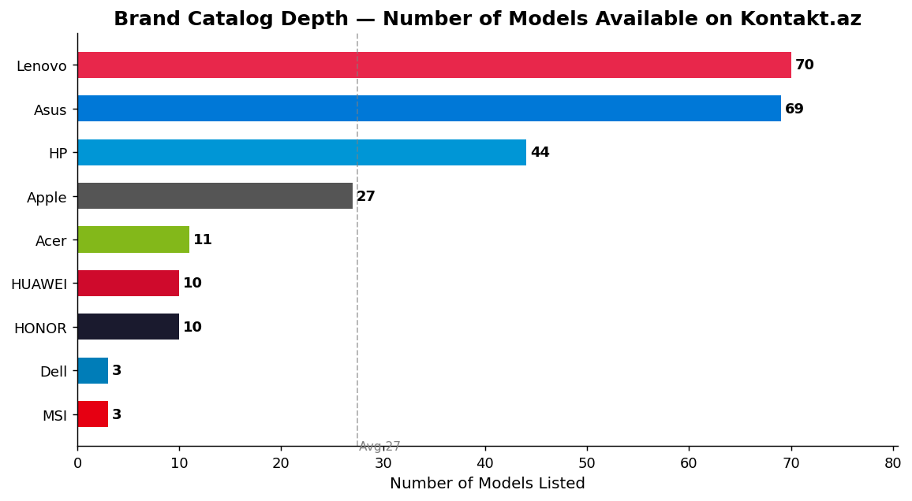
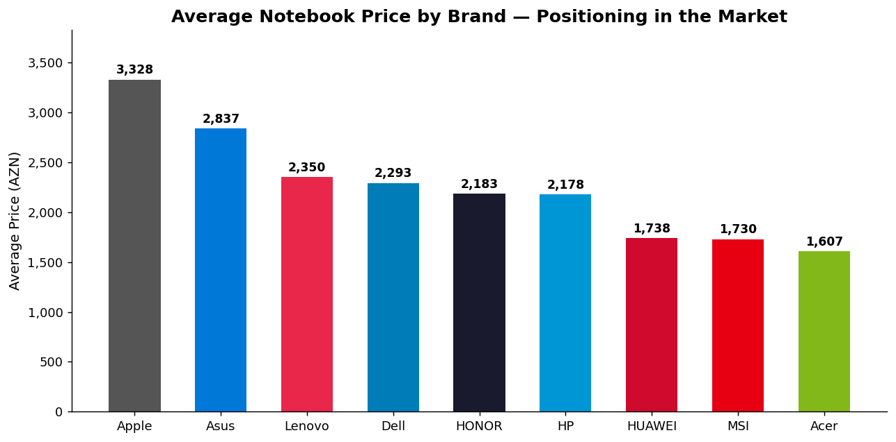
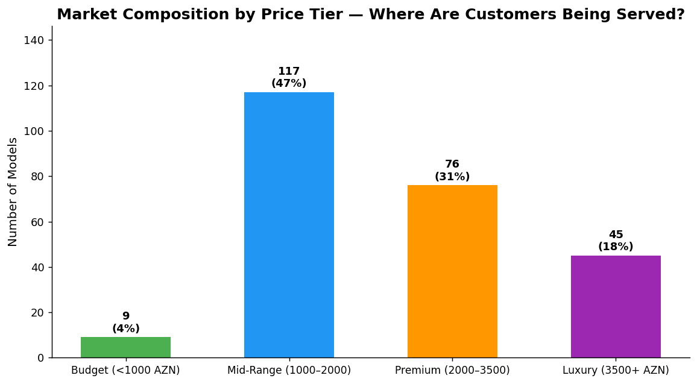
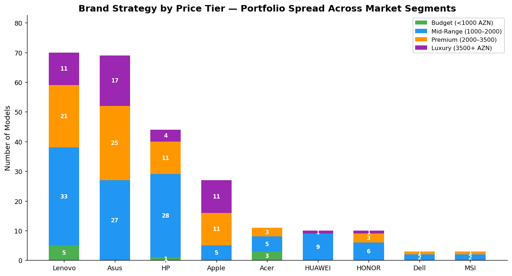
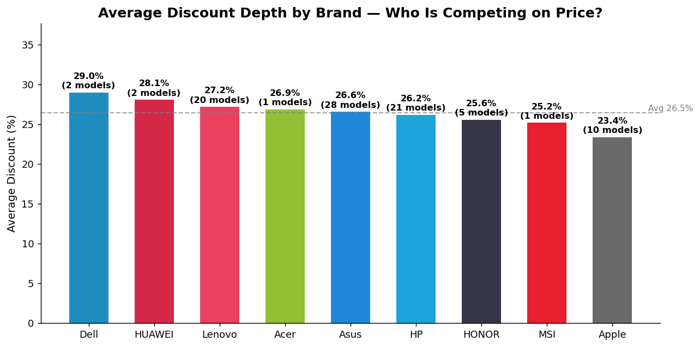
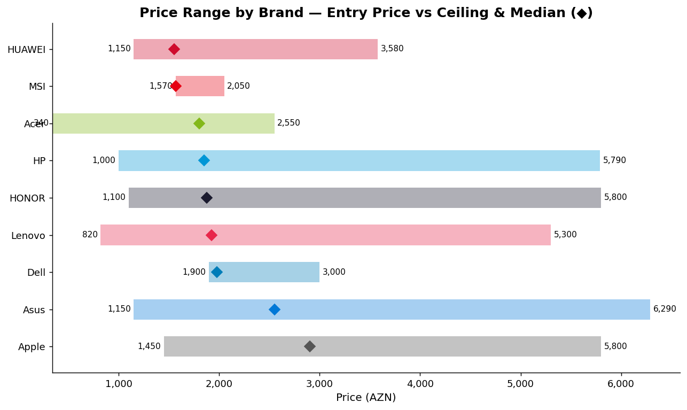
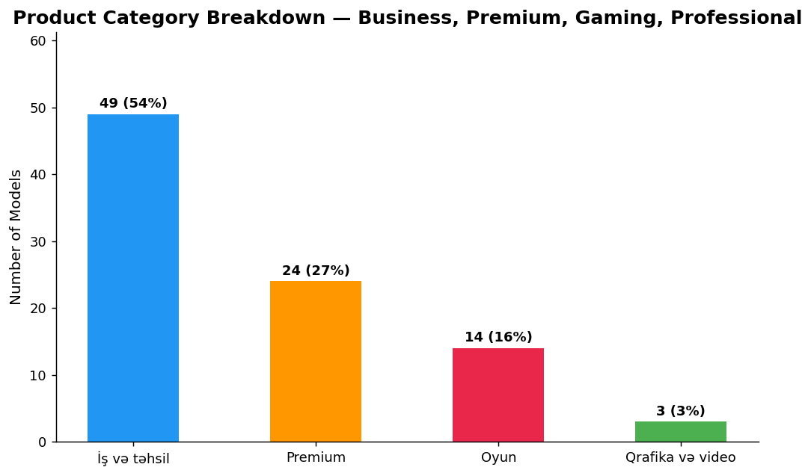
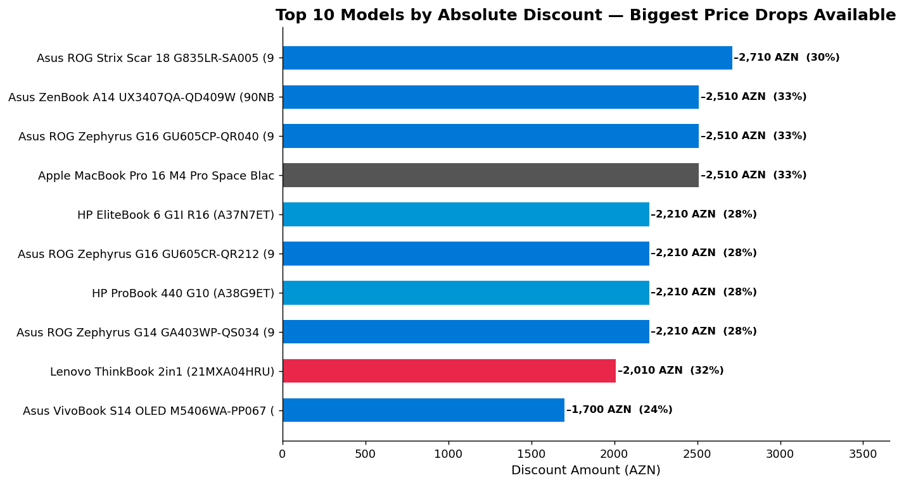
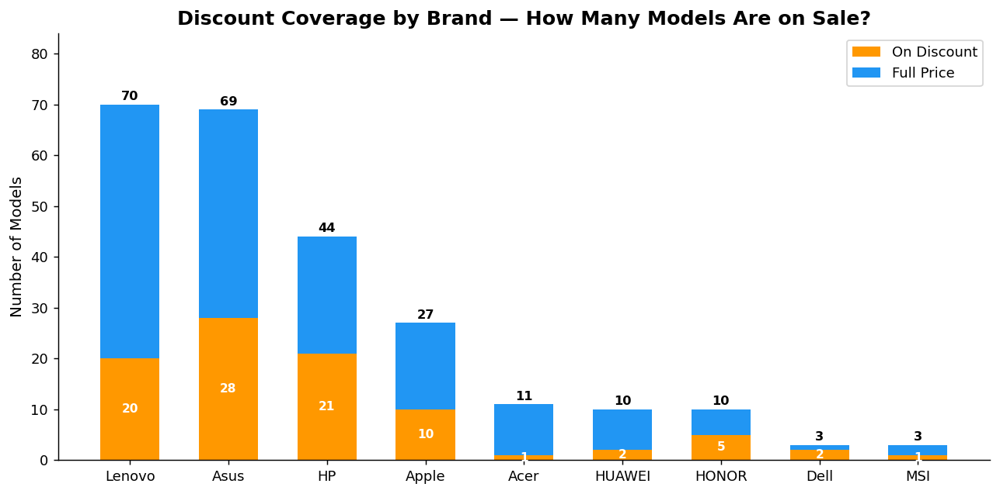
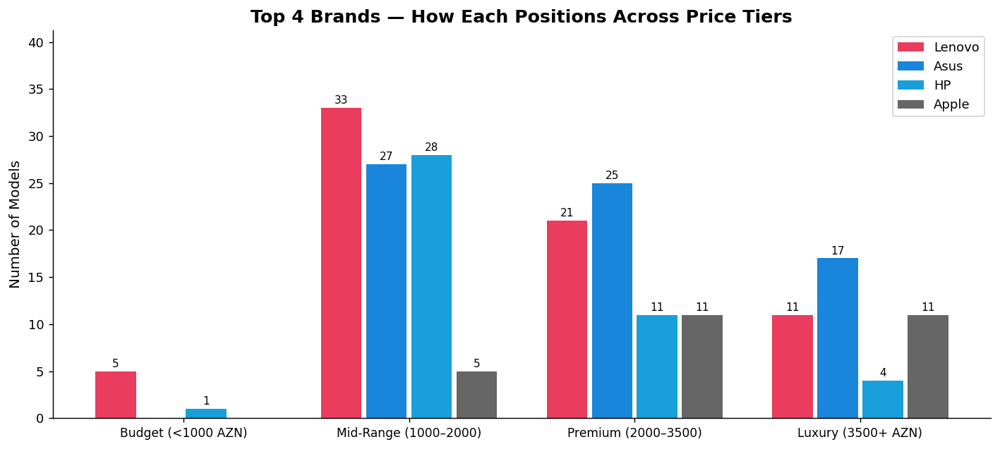

# Kontakt.az Notebook Market — Executive Insight Report

**Market:** Azerbaijan | **Platform:** kontakt.az | **Catalog Size:** 247 notebook models | **Brands:** 9

---

## Summary

This report analyzes the full notebook catalog on kontakt.az — Azerbaijan's leading electronics retailer.
The analysis covers brand positioning, pricing strategy, discount activity, and product mix.
Every finding is supported by data and translated into a clear business decision or opportunity.

---

## 1. Brand Catalog Depth — Who Dominates the Shelf?

**What it shows:** The number of notebook models each brand lists on the platform.

**Why it matters:**
Lenovo and Asus jointly dominate the catalog with 70 and 69 models respectively — nearly **57% of all listings**.
This level of concentration means these two brands control the majority of purchase touchpoints and customer consideration.
HP (44 models) holds a strong third position, while Apple (27), HONOR (10), HUAWEI (10), Acer (11), MSI (3), and Dell (3) fill niche or limited roles.

**Decision / Action:**
- Brands with fewer than 15 models (MSI, Dell, Acer) should evaluate whether their limited presence is intentional (premium exclusivity) or a missed opportunity.
- Competitors benchmarking against Kontakt.az should match or exceed Lenovo/Asus catalog depth to achieve comparable shelf visibility.

---

## 2. Average Price by Brand — Market Positioning

**What it shows:** The average listing price per brand across all their models.

**Why it matters:**
Apple leads at an average of **3,328 AZN** — more than double the average of budget-leaning brands like Acer (1,607 AZN) and MSI (1,730 AZN).
Asus (2,837 AZN) and Lenovo (2,350 AZN) occupy the mid-to-premium space, positioning them as the core volume-and-value players.
Dell (2,293 AZN) and HP (2,178 AZN) align closely with the market median.

**Decision / Action:**
- Apple's high average price signals a strong premium brand perception — a retailer could use this as justification to create a dedicated premium section or bundled accessory upsell.
- Lenovo and Asus, despite high volume, maintain respectable average prices — indicating they are not competing purely on price.
- Acer's low average price makes it the clearest budget-segment entry point for price-sensitive segments.

---

## 3. Market Composition by Price Tier

**What it shows:** How the full catalog breaks down across four price tiers: Budget (under 1,000 AZN), Mid-Range (1,000–2,000 AZN), Premium (2,000–3,500 AZN), and Luxury (3,500+ AZN).

**Why it matters:**
The market skews heavily toward **mid-range (47%)** and **premium (31%)**, with only **4% of models priced below 1,000 AZN**.
The significant 18% luxury segment (45 models above 3,500 AZN) indicates that high-end consumers are being actively served — or targeted.

**Decision / Action:**
- The near-absence of budget models is a clear gap. A brand or retailer that aggressively stocks sub-1,000 AZN products could capture first-time buyers or corporate bulk purchasers.
- The 31% premium + 18% luxury share (almost half the catalog) confirms Azerbaijan's notebook market is maturing — buyers are willing to spend, not just searching for the cheapest option.

---

## 4. Brand Strategy Across Price Tiers

**What it shows:** For each brand, how their models are distributed across the four price tiers.

**Why it matters:**
This chart reveals each brand's strategic intent:

- **Lenovo** has the broadest coverage — models in every tier, including the most mid-range options (30+ models). This is a full-spectrum mass-market strategy.
- **Asus** mirrors Lenovo's breadth but leans more into premium and luxury, with the largest luxury portfolio of any brand.
- **HP** is heavily concentrated in mid-range and premium, with limited luxury exposure.
- **Apple** has zero budget or mid-range presence — every model is premium or luxury. This is a deliberate positioning decision that protects brand equity.

**Decision / Action:**
- If a buyer segment demands mid-range reliability, Lenovo and HP are the obvious sourcing choices. Retail promotions should be designed accordingly.
- Apple's clean premium exclusivity makes it a poor candidate for price promotions — discount-led campaigns risk brand dilution.
- Asus's luxury portfolio depth makes it the highest-risk brand for slow inventory turnover if economic conditions weaken.

---

## 5. Discount Depth by Brand — Who Is Competing on Price?

**What it shows:** The average percentage discount applied to models currently on sale, by brand.

**Why it matters:**
Dell leads with an average **29% discount** on its on-sale models, followed closely by HUAWEI (28.1%), Lenovo (27.2%), and Acer (26.9%).
Apple has the lowest average discount at **23.4%** — reinforcing its premium, low-discount positioning.
The fact that most brands cluster around 25–29% suggests this has become the industry norm for promotional depth on this platform.

**Decision / Action:**
- A 25–30% discount range appears to be the "activation threshold" that Azerbaijani consumers expect before a deal feels worthwhile — pricing strategies should be calibrated to this expectation.
- Dell's high discount depth on a small catalog suggests it may be using steep promotions to drive awareness — a viable short-term strategy, but one that risks conditioning buyers to wait for sales.
- HUAWEI's high discount rate combined with a mid-tier average price signals aggressive market penetration.

---

## 6. Price Range by Brand — Entry Point vs Ceiling

**What it shows:** The minimum, maximum, and median price for each brand's catalog. The bar represents the price range; the diamond (◆) marks the median.

**Why it matters:**
- **Apple** has the narrowest range relative to its median — concentrated premium positioning with no cheap entry point.
- **Asus** has the widest absolute range (from under 1,000 AZN to over 6,000 AZN) — the most diverse portfolio of any brand on the platform.
- **Lenovo** has a low entry point (under 820 AZN) but a high ceiling (nearly 4,900 AZN), showing genuine all-segment coverage.
- **Acer** sits low in price, with a ceiling well below most competitors — reinforcing its budget-to-mid positioning.

**Decision / Action:**
- Brands with wide ranges (Asus, Lenovo) must invest more in in-store navigation tools (filters, comparisons) to help buyers self-select — otherwise customers feel overwhelmed.
- The entry price is a critical acquisition tool: Lenovo's sub-820 AZN entry and Acer's sub-340 AZN Chromebook are the strongest hooks for first-time laptop buyers.

---

## 7. Product Category Mix

**What it shows:** Distribution of notebooks by use-case category: Business/Education (İş və təhsil), Premium, Gaming (Oyun), and Graphics/Video (Qrafika və video).

**Why it matters:**
Among the 90 products with categorization data, **54% are positioned for business and education** — the dominant use case.
**Premium** accounts for 27%, **Gaming** for 15%, and **Graphics/Video** for just 3%.

**Decision / Action:**
- The business/education majority reflects Azerbaijan's corporate procurement market. B2B sales channels, bulk pricing, and invoice-based purchasing should be prioritized.
- Gaming is 15% of categorized products but likely over-indexed in revenue per unit — gaming models command premium prices. Dedicated gaming promotions or bundles could yield high ROI.
- The Graphics/Video segment (3 models) is effectively unserved — a niche but potentially high-value opportunity for professional content creators, architects, and designers.

---

## 8. Top 10 Models by Absolute Discount Value

**What it shows:** The ten models with the largest absolute price reduction in AZN, along with their percentage discount.

**Why it matters:**
The largest savings in absolute terms are concentrated in high-ticket Apple, Asus, and Lenovo models — the top discounted product saves buyers over **2,500 AZN**.
These are not small, entry-level deals — they are significant value events on expensive products.

**Decision / Action:**
- These top-discounted models are natural candidates for homepage banners, email campaigns, and social media promotions — the absolute AZN savings are compelling and emotionally motivating for buyers.
- High-value discounts on Apple products are rare — any active Apple promotion should be treated as a limited-time urgency event to drive conversion.
- Retailers can use these models as "hero deals" that draw traffic and upsell shoppers to accessories or service plans.

---

## 9. Discount Coverage by Brand — How Many Models Are on Sale?

**What it shows:** For each brand, how many models are currently discounted (orange) versus full price (blue).

**Why it matters:**
The two volume leaders, **Lenovo and Asus**, have roughly one-third of their catalogs on discount — a deliberate but controlled promotional strategy.
**HP** has a notably high proportion of discounted models relative to its catalog size.
**Apple** discounts a small fraction of its lineup, preserving full-price positioning.
**MSI** and **Dell** have 100% of their small catalogs on sale — suggesting clearance or introductory pricing.

**Decision / Action:**
- Brands with high discount coverage (MSI, Dell, HP) may be managing inventory pressure or trying to gain traction. Buyers looking for value should target these.
- Lenovo and Asus's controlled discount ratio (≈30–35%) is the healthiest pattern — enough to stimulate demand without devaluing the brand.
- A retailer could increase conversion on Apple products by making the few discounted models highly prominent, given their rarity.

---

## 10. Top 4 Brands — Positioning Across Price Tiers

**What it shows:** Side-by-side comparison of how Lenovo, Asus, HP, and Apple each distribute their models across the four price tiers.

**Why it matters:**
This chart shows the competitive dynamics in each price tier:

- **Budget tier:** Only Lenovo and Asus compete — HP and Apple are completely absent.
- **Mid-range tier:** Lenovo and HP dominate; Apple has zero presence.
- **Premium tier:** All four brands compete, but Asus and HP lead in volume.
- **Luxury tier:** Asus leads with the most luxury models; Apple follows; HP and Lenovo are limited.

**Decision / Action:**
- In the mid-range — the largest single tier (47% of the market) — HP and Lenovo are the primary combatants. Whoever wins on product quality and promotional offers in this tier wins the market.
- Apple's strategy of staying out of budget and mid-range is defensible only as long as premium brand perception holds. Any erosion in brand prestige could damage margins significantly.
- Asus's leadership in the luxury tier, combined with strong mid-range presence, makes it the most strategically exposed brand — it has the most to lose if a price war starts at either end of the spectrum.

---

## Key Takeaways for Decision-Makers

| Insight | Implication |
|---|---|
| Lenovo + Asus = 57% of catalog | Competing without them means fighting for 43% of the shelf |
| Mid-range dominates (47%) | Volume strategies must target the 1,000–2,000 AZN zone |
| Budget segment underserved (4%) | First entry-price products could capture untapped demand |
| Average discount cluster: 25–30% | Promotions below this threshold are unlikely to change buying behavior |
| Apple has the highest avg price (3,328 AZN) | Premium brand — protect price; use scarcity in promotions |
| Gaming = 15% of assortment | Disproportionate revenue opportunity relative to unit count |
| Dell + MSI: 100% on discount | Either entering market aggressively or clearing slow inventory |
| Business/Education = 54% of categorized models | B2B channels are the largest addressable demand pool |

---

*Data source: kontakt.az product catalog — 247 notebook models across 9 brands.*
*Charts generated by `scripts/generate_charts.py`.*
